# Sommaire

- [Sommaire](#sommaire)
- [Entretien mercredi 11 septembre 2024](#entretien-mercredi-11-septembre-2024)
  - [Personnes présentes](#personnes-présentes)
  - [Sujet](#sujet)
  - [Plaquette présentée](#plaquette-présentée)
  - [Sélection](#sélection)
  - [Retours](#retours)
    - [Logo 1](#logo-1)
    - [Logo 2](#logo-2)
    - [Logo 3](#logo-3)
    - [Logo 4](#logo-4)
    - [Logo 5](#logo-5)
    - [Logo 6](#logo-6)
    - [Logo 7](#logo-7)
  - [Envoi de nouveaux logos](#envoi-de-nouveaux-logos)
- [Proposition pour mardi 17 septembre 2024](#proposition-pour-mardi-17-septembre-2024)
  - [Aperçu](#aperçu)
  - [Logo#1](#logo1)
    - [Plaquette](#plaquette)
    - [Argumentaire Logo#1](#argumentaire-logo1)
    - [Conclusion](#conclusion)
  - [Logo#2](#logo2)
    - [Plaquette](#plaquette-1)
    - [Argumentaire Logo#2](#argumentaire-logo2)
    - [Points à améliorer](#points-à-améliorer)
    - [Conclusion](#conclusion-1)
  - [Logo 3](#logo-3-1)
    - [Plaquette](#plaquette-2)
    - [Argumentaire Logo#3](#argumentaire-logo3)
    - [Conclusion](#conclusion-2)
    - [Variante](#variante)
    - [Autres variantes](#autres-variantes)
  - [Logo#4](#logo4)
    - [Plaquette](#plaquette-3)
    - [Argumentaire Logo#4](#argumentaire-logo4)
    - [Conclusion](#conclusion-3)
  - [Logo#5](#logo5)
    - [Plaquette](#plaquette-4)
    - [Argumentaire Logo#5](#argumentaire-logo5)
    - [Conclusion](#conclusion-4)
  - [Logo#6](#logo6)
    - [Plaquette](#plaquette-5)
    - [Argumentaire Logo#6](#argumentaire-logo6)
  - [Logo#7](#logo7)
    - [Plaquette](#plaquette-6)
    - [Argumentaire Logo#7](#argumentaire-logo7)
  - [Logo 8](#logo-8)
    - [Plaquette](#plaquette-7)
    - [Argumentaire Logo#8](#argumentaire-logo8)
    - [Conclusion](#conclusion-5)

---

# Entretien mercredi 11 septembre 2024

## Personnes présentes

1. Madame Catteau
2. Madame Brigitte
3. Moi-même

## Sujet

Délibération à propos des logos

## Plaquette présentée

## Sélection

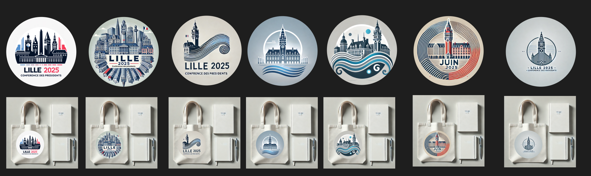

## Retours

### Logo 1

1. Supprimer le bâtiment de type tribunal en premier plan.
2. Remplacer l’obélisque par la colonne de la déesse.

### Logo 2

- Trop chargé selon mes tutrices, mais tout de même à présenter auprès du président et vice-président.

### Logo 3

- La vague casse un peu la mise en scène, voir pour la réduire ou la supprimer.

### Logo 4

- Ajout de la mention :
  - "Lille 2025"
  - "Conférence des présidents"

### Logo 5

- Ajout des textes "Lille 2025" et "Conférence des présidents".

### Logo 6

- Peut être apprécié, à soumettre auprès du président et vice-président.

### Logo 7

- Ajouter des éléments graphiques qui rappellent la République française.

## Envoi de nouveaux logos

Création de nouveaux logos :

- Au style minimaliste et moderne.
- Au style plus élaboré.
- Création de plusieurs logos contenant :
  - Les couleurs des Flandres (jaune, noir et rouge).
  - Des bâtiments et monuments typiques de Lille.

---

# Proposition pour mardi 17 septembre 2024

### Aperçu

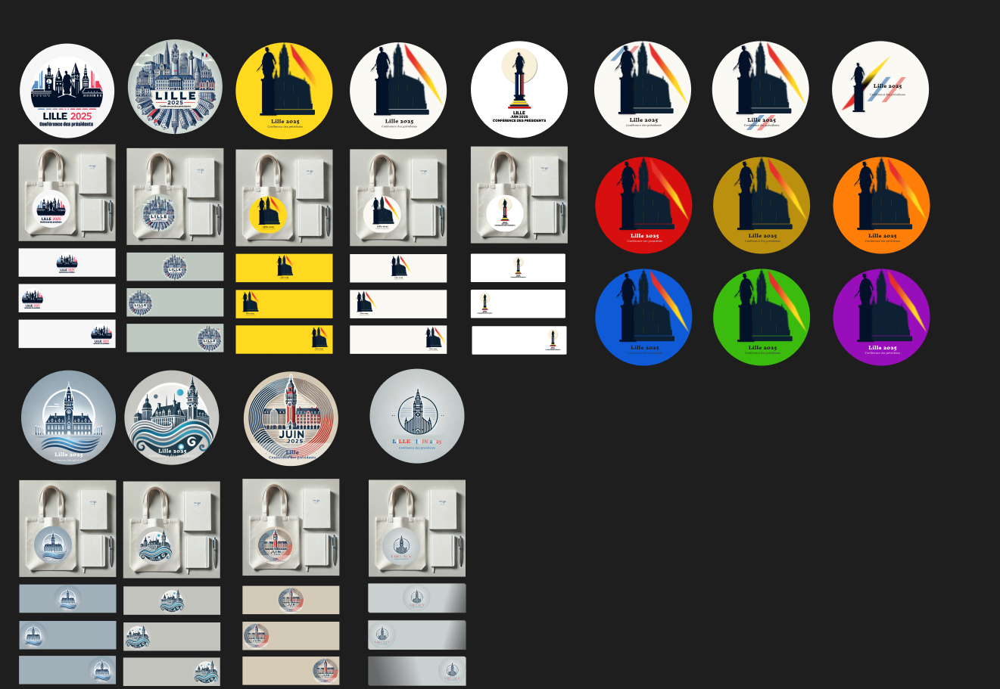

---

## Logo#1

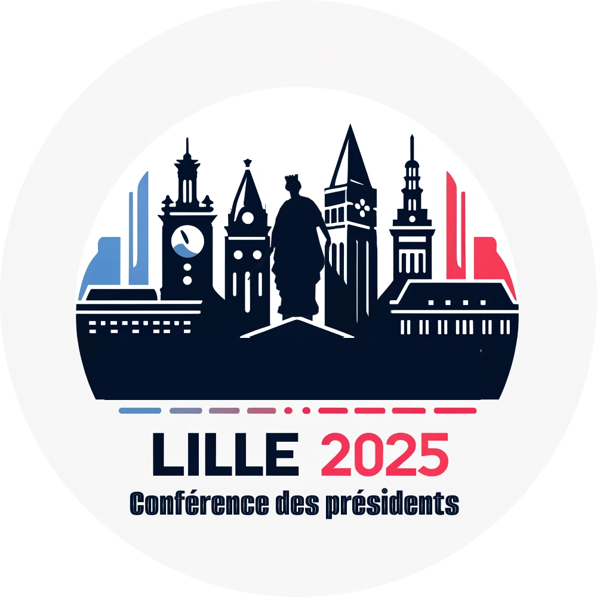

---

### Plaquette

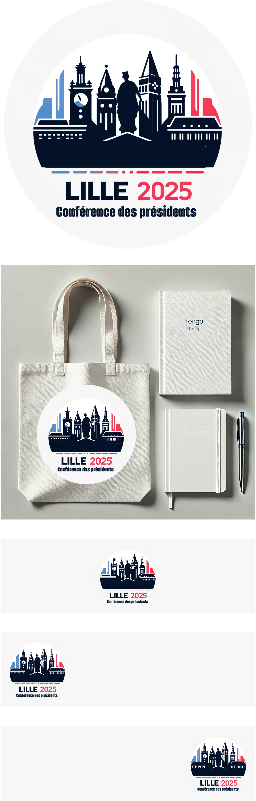

---

### Argumentaire Logo#1

1. **Représentation visuelle de Lille et de son patrimoine**

   - Le logo met en valeur les **éléments architecturaux emblématiques de Lille**, symbolisant l'héritage historique et l'importance de la ville.
   - La statue intégrée au centre joue un rôle essentiel, renforçant l'identité visuelle du projet.

2. **Modernité et sobriété dans le style graphique**

   - Style graphique **moderne et minimaliste**, créant un équilibre entre tradition et modernité.
   - Adaptable sur différents supports : cartes de visite, bannières, affiches, supports numériques.

3. **Palette de couleurs bien pensée**

   - Utilisation des couleurs bleu, blanc et rouge, évoquant la France tout en symbolisant les Hauts-de-France.
   - Excellente lisibilité et cohérence visuelle avec des contrastes marqués.

4. **Typographie moderne et accessible**

   - La **typographie claire et moderne** permet une lecture fluide des informations.

5. **Personnalisation et adaptabilité**

   - Versions dérivées permettant une flexibilité selon les contextes d'utilisation, tout en maintenant la cohérence visuelle.

6. **Cohérence avec l'événement "Conférence des Présidents"**
   - Style sérieux et professionnel, en adéquation avec l'image attendue de l'événement.

### Conclusion

Ce logo capture **l'essence de Lille** tout en restant **professionnel et élégant**, et s'adapte à tous types de supports.

---

## Logo#2

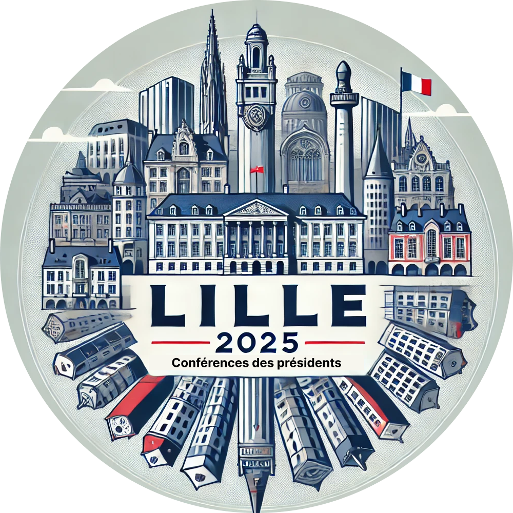

---

### Plaquette

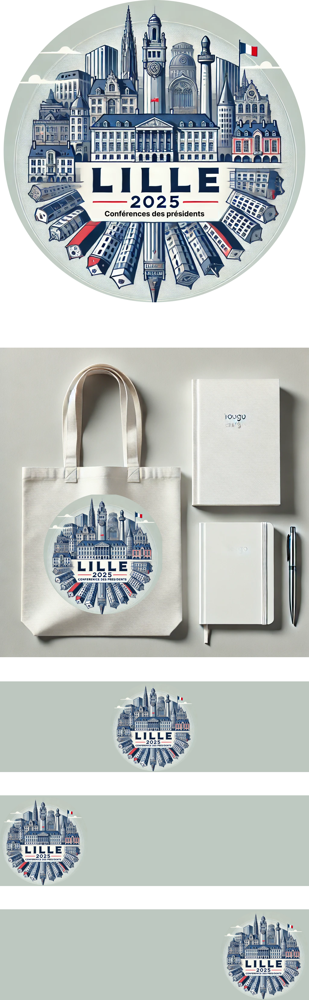

---

### Argumentaire Logo#2

1. **Représentation visuelle complète de Lille**

   - Mises en scène de **bâtiments emblématiques** de Lille, capturant le patrimoine architectural de la ville.
   - **Couleurs bleu, blanc, rouge** renforçant l'ancrage national.

2. **Ambition visuelle et style détaillé**

   - Style très détaillé reflétant la richesse de l'architecture lilloise.

3. **Symbolique de l'événement**
   - Texte "LILLE 2025 - Conférence des Présidents" bien positionné et lisible.

### Points à améliorer

1. **Surcharge visuelle**

   - Possibilité de simplifier certains éléments pour alléger la composition.

2. **Renforcement du lien avec les Hauts-de-France**

   - Intégration de symboles plus larges ou de couleurs régionales pour une approche plus régionale.

3. **Lisibilité et simplicité**
   - Simplifier la composition pour une meilleure lisibilité sur petits supports.

### Conclusion

Le logo représente bien Lille, mais **gagnerait en lisibilité et simplicité** avec quelques ajustements.

---

## Logo 3

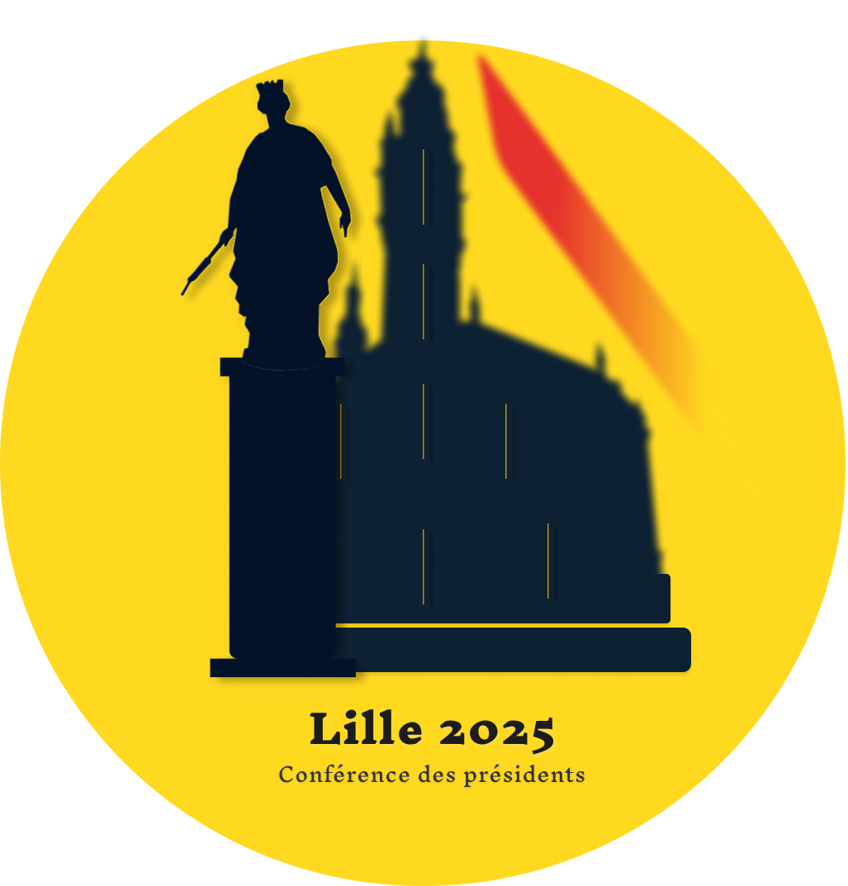

---

### Plaquette

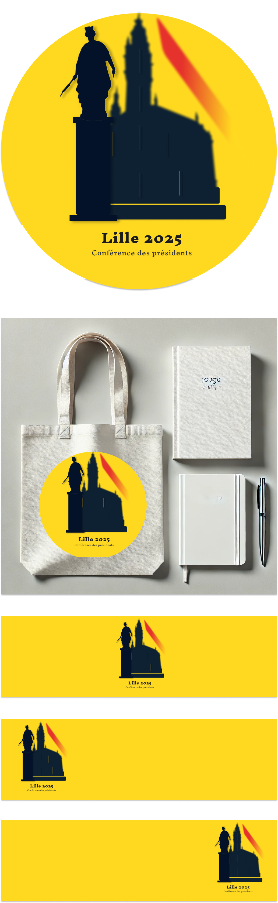

---

### Argumentaire Logo#3

1. **Représentation iconique et symbolique de Lille**

   - Mise en avant de **symboles forts** de Lille, tels que la statue de la déesse et le beffroi de la Chambre de Commerce.

2. **Intégration des couleurs des Flandres**

   - Subtiles touches de rouge et doré rappelant les **couleurs emblématiques des Flandres**.

3. **Design moderne et élégant**

   - Formes épurées et **ombres douces**, créant une impression de modernité.

4. **Texte bien intégré et lisible**

   - Espacement et taille de police garantissant une bonne lisibilité.

5. **Adaptabilité et optimisation du fond jaune**
   - Possibilité d'ajuster le fond jaune pour une meilleure lisibilité sur le web.

### Conclusion

Ce logo combine **symbolisme régional** et **élégance**, avec une option d'ajustement pour une meilleure optimisation web.

---

### Variante

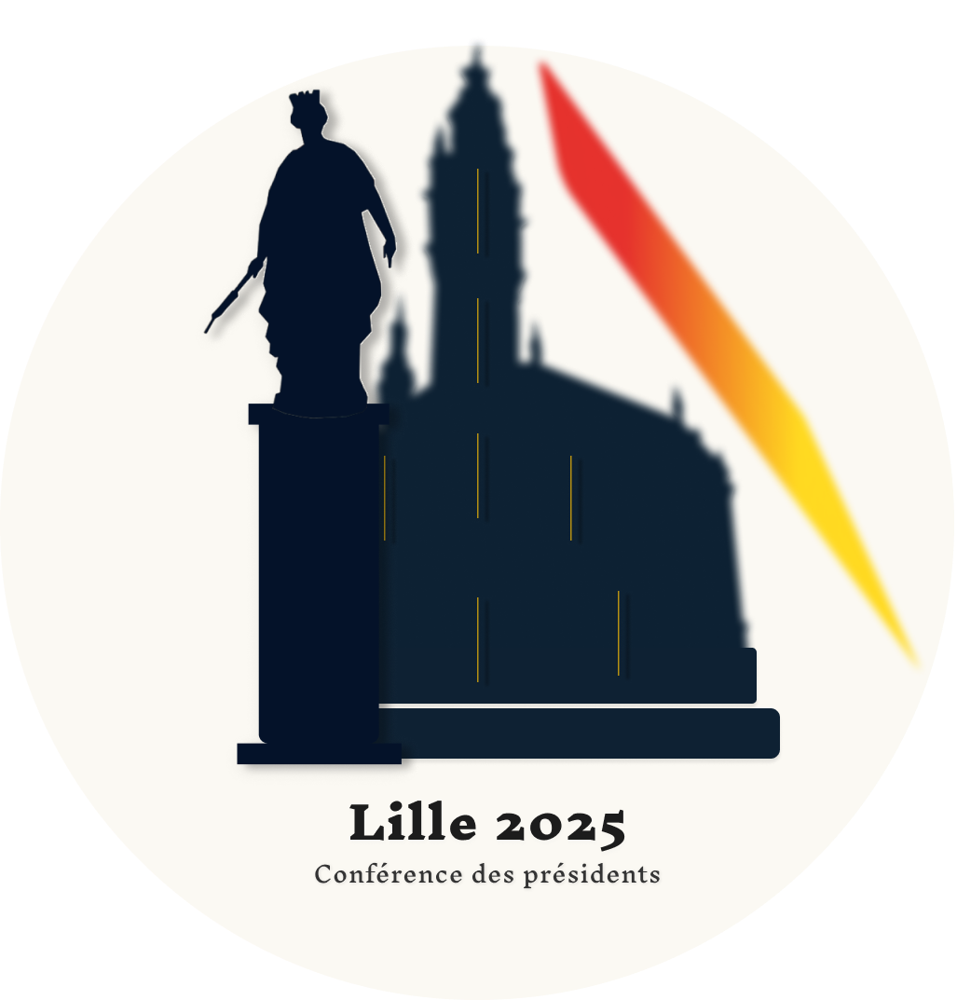

---

### Autres variantes

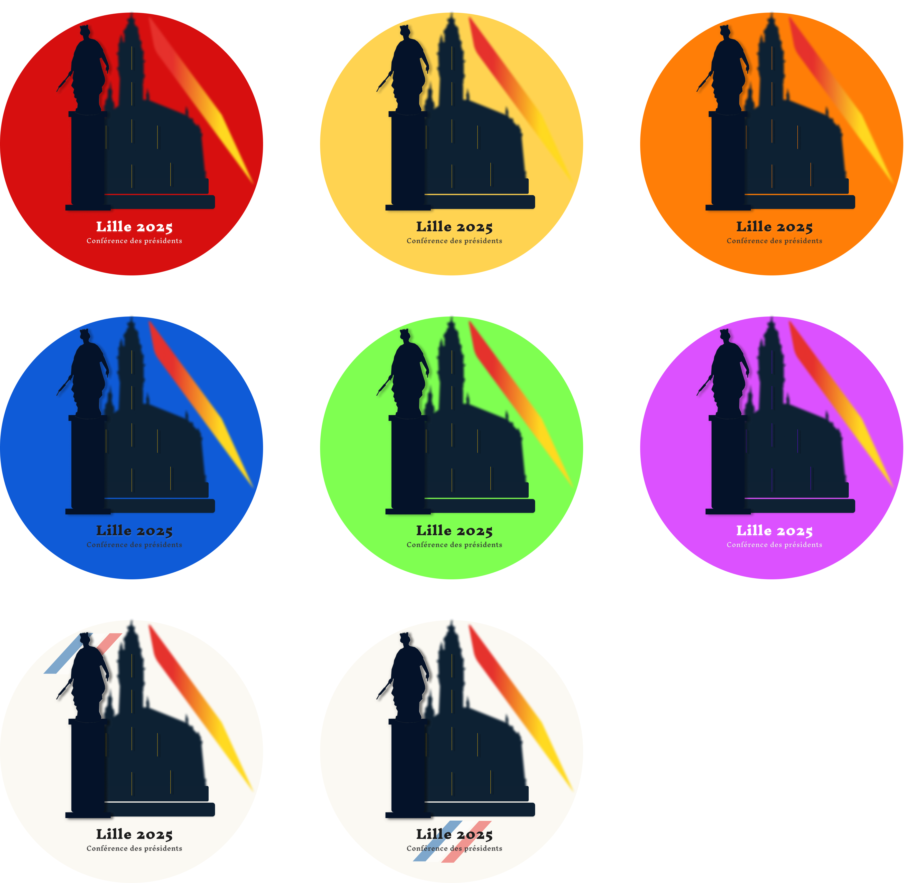

---

## Logo#4

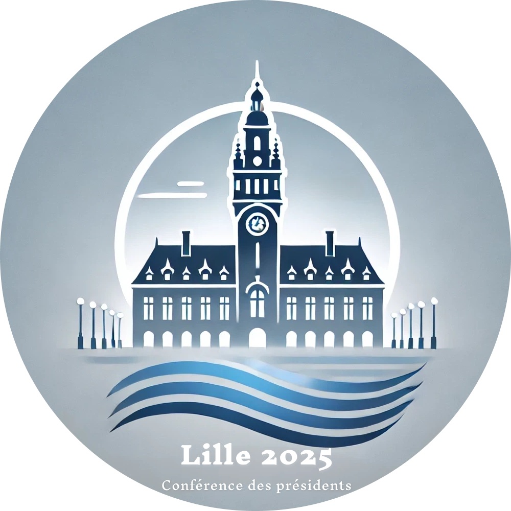

---

### Plaquette

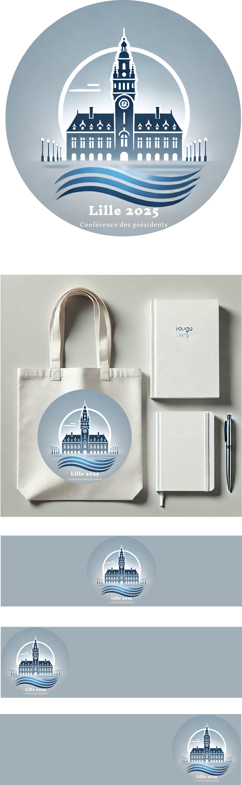

---

### Argumentaire Logo#4

1. **Une mise en valeur architecturale de Lille**

   - Le beffroi de la Chambre de Commerce est mis en avant pour illustrer l’ancrage régional de l'événement.

2. **Fluidité et modernité grâce aux vagues**

   - Les vagues en bas introduisent un mouvement fluide, symbolisant les rivières et les échanges lors de la conférence.

3. **Couleurs sobres et élégantes**
   - Fond gris-bleu et détails en blanc assurent une élégance professionnelle.

### Conclusion

Le logo allie **tradition** et **modernité**, en parfaite adéquation avec l’événement.

---

## Logo#5

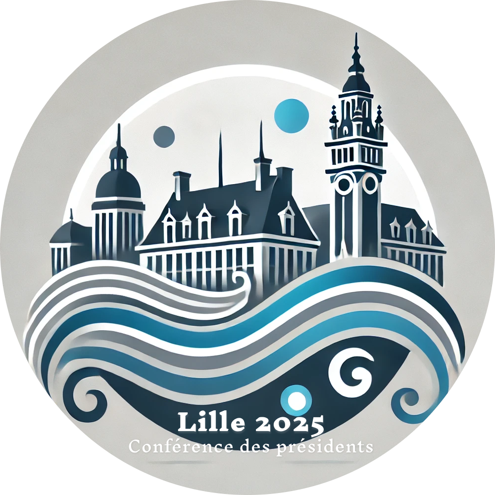

---

### Plaquette

---

### Argumentaire Logo#5

1. **Représentation architecturale forte**

   - Mise en avant du beffroi et de bâtiments emblématiques de Lille.

2. **Vague subtile et symbolique**
   - La vague symbolise le mouvement et les échanges entre participants.

### Conclusion

Un équilibre entre **histoire et modernité**, avec un fort ancrage régional et une lisibilité améliorée.

---

## Logo#6

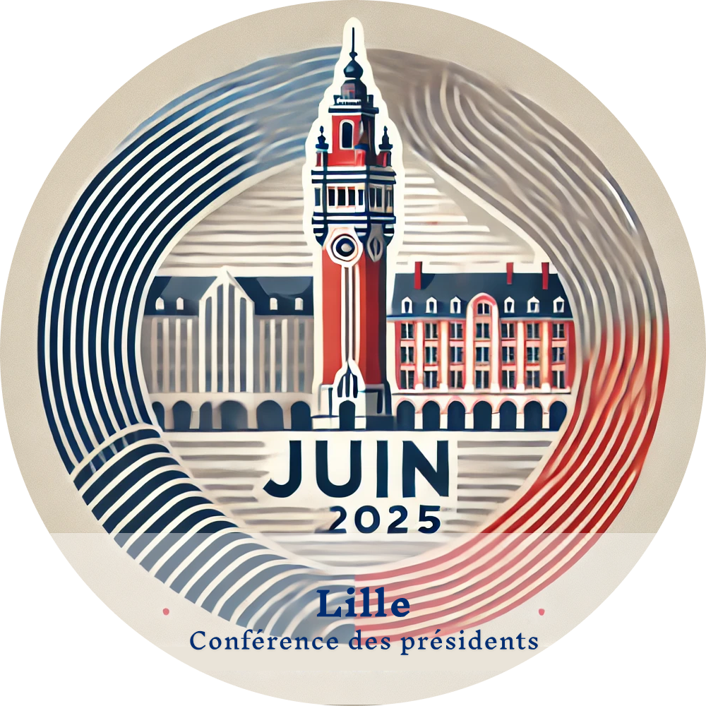

---

### Plaquette

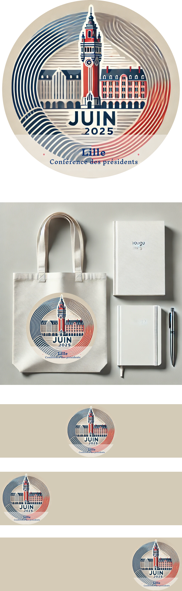

---

### Argumentaire Logo#6

1. **Représentation iconique de Lille**

   - Le beffroi et les bâtiments sont au centre, soulignant le patrimoine culturel.

2. **Utilisation des couleurs régionales**
   - Les couleurs bleu, blanc et rouge évoquent à la fois la France et la région.

---

## Logo#7

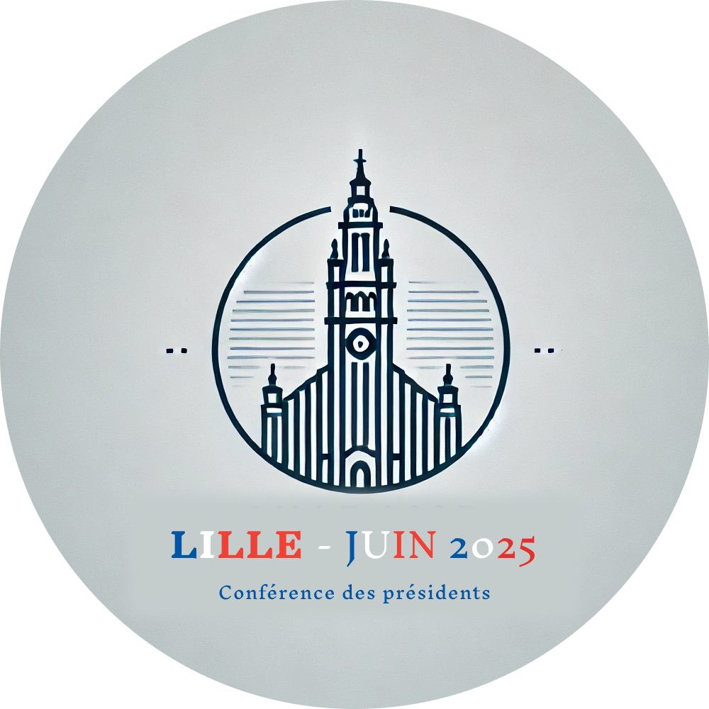

---

### Plaquette

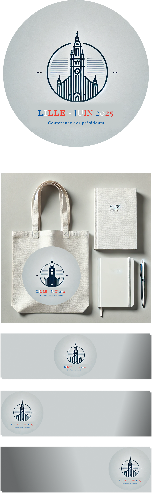

---

### Argumentaire Logo#7

1. **Un design minimaliste et moderne**

   - Le tracé simple et épuré du beffroi de Lille le rend reconnaissable et adaptable à tous les formats.

2. **Intégration subtile des couleurs tricolores**
   - Les couleurs bleu, blanc et rouge dans le texte "Lille - Juin 2025" rappellent discrètement le drapeau français.

---

## Logo 8

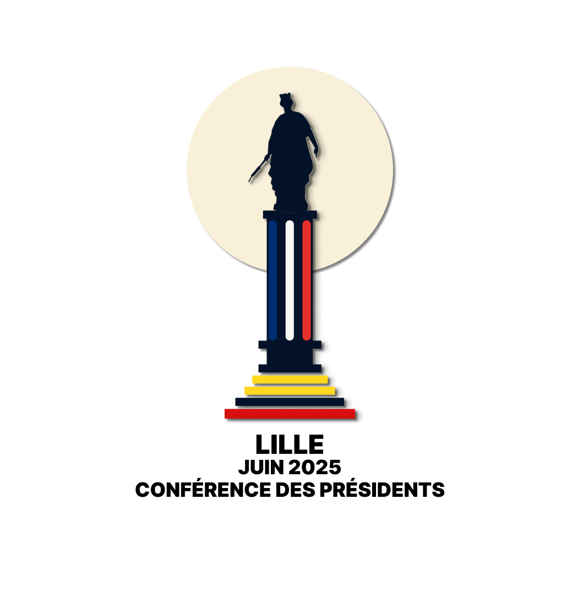

### Plaquette

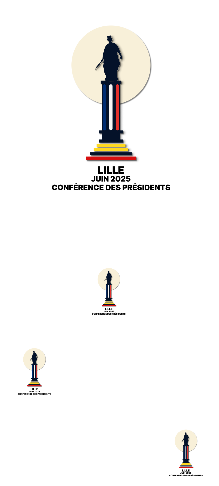

### Argumentaire Logo#8

1. **Un design symbolique et épuré**

   - Ce logo représente la **statue de la déesse** de Lille, un monument emblématique, placé au sommet d'une colonne colorée en bleu, blanc et rouge, rappelant les couleurs du drapeau français. La colonne elle-même est un symbole de force et de stabilité, des qualités en lien direct avec la stature de l'événement.
   - La simplicité de ce design permet de capturer l'essence de Lille tout en restant facilement reconnaissable et mémorable.

2. **Couleurs et symbolisme régional**

   - Les **marches jaunes et rouges** au bas de la colonne font référence aux **Flandres**, renforçant l'identité régionale de Lille tout en ajoutant une dimension visuelle forte.
   - L’utilisation des couleurs du drapeau français dans la colonne centrale permet d’ancrer l’événement dans son contexte national, tout en étant un hommage subtil à l’identité française.

3. **Un logo polyvalent et percutant**

   - Grâce à sa composition minimaliste et bien structurée, ce logo est parfaitement **adaptable à différents formats**. Il fonctionnera aussi bien sur des supports physiques (bannières, badges, brochures) que numériques (sites web, réseaux sociaux).
   - La lisibilité du texte "Lille Juin 2025 - Conférence des Présidents" est optimisée pour garantir une lecture fluide même à plus petite échelle. Le choix de la typographie en gras, en particulier pour le nom de l’événement, souligne l’importance et le prestige de celui-ci.

4. **Équilibre entre tradition et modernité**

   - Ce design minimaliste parvient à combiner des éléments de **tradition** (la statue, les couleurs nationales et régionales) avec une **approche moderne** (style épuré, simplicité des formes). Cet équilibre est essentiel pour représenter un événement aussi important que la Conférence des Présidents.
   - Le cercle clair en arrière-plan agit comme un point focal subtil, ajoutant de la profondeur au logo sans surcharger le design.

5. **Adaptation visuelle cohérente et professionnelle**

   - Ce logo assure une **cohérence visuelle** qui s’intègre parfaitement dans l’identité visuelle globale de l’événement. Il envoie un message clair d’unité, de force et de professionnalisme, qualités attendues pour un événement de ce calibre.
   - La disposition symétrique des éléments assure une bonne lisibilité et une compréhension immédiate de l’objet du logo, peu importe où il sera utilisé.

6. **Facilité de reconnaissance et de mémorisation**
   - L'iconographie de la **statue de la déesse**, en lien direct avec Lille, permettra aux participants de reconnaître immédiatement l’ancrage local de l’événement. Les éléments de couleur et la simplicité du design facilitent sa mémorisation, un critère essentiel pour renforcer la notoriété de la Conférence des Présidents.

---

### Conclusion

Ce logo répond parfaitement aux exigences d’un événement national en mêlant symbolisme, simplicité et efficacité visuelle. Il incarne l’esprit de Lille tout en respectant les codes professionnels et institutionnels de la **Conférence des Présidents**. Son impact visuel, sa flexibilité d’utilisation et son message clair le rendent idéal pour représenter l’événement sur tous les supports, des plus formels aux plus informels.

---
