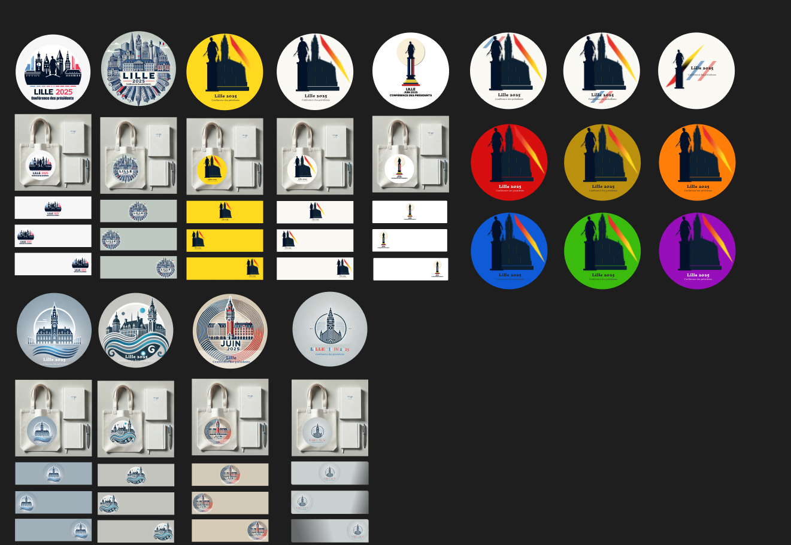

Un logo trop détaillé peut poser des problèmes en termes de SEO (référencement) et d'accessibilité pour plusieurs raisons, ce qui peut expliquer le passage à un design plus minimaliste.

## Aperçu

### 1. **Problèmes de SEO**

- **Temps de chargement** : Les logos trop complexes ont souvent des fichiers plus lourds, ce qui peut ralentir le chargement des pages web. Or, un temps de chargement élevé peut impacter négativement le SEO. Les moteurs de recherche privilégient les sites rapides dans les résultats de recherche.
- **Balises alt et indexation** : Pour le SEO, les images doivent être accompagnées de balises alt descriptives. Un logo complexe rend cette tâche plus difficile, car il nécessite une description plus longue. Cela peut rendre la compréhension du logo par les moteurs de recherche moins claire.

### 2. **Problèmes d'accessibilité**

- **Lisibilité** : Les logos avec trop de détails deviennent illisibles à de petites tailles, comme sur les écrans de smartphones ou tablettes, ou sur des versions allégées du site. L'accessibilité visuelle est donc réduite, affectant les utilisateurs malvoyants ou ceux qui utilisent des dispositifs de lecture d’écran.
- **Compatibilité avec les outils d'accessibilité** : Les outils comme les lecteurs d'écran peuvent rencontrer des difficultés à interpréter des images complexes. Un logo minimaliste est plus facilement décrivable via une balise alt concise, améliorant l'expérience des utilisateurs.

### 3. **Avantages d’un design minimaliste**

- **Adaptabilité et réactivité** : Un logo simple est plus facile à adapter aux différents formats d’affichage (mobile, desktop, etc.) et aux plateformes numériques. Cela contribue à une meilleure expérience utilisateur et à une meilleure navigation.
- **Reconnaissance immédiate** : Les logos épurés permettent une reconnaissance rapide de la marque ou de l'événement. Leur simplicité visuelle améliore également l'impact mémoriel.

En résumé, le passage à un design minimaliste aide à réduire les temps de chargement, à améliorer l’accessibilité, tout en renforçant l'identité visuelle du site sur différents supports, ce qui est essentiel pour un bon SEO et une expérience utilisateur optimisée.
