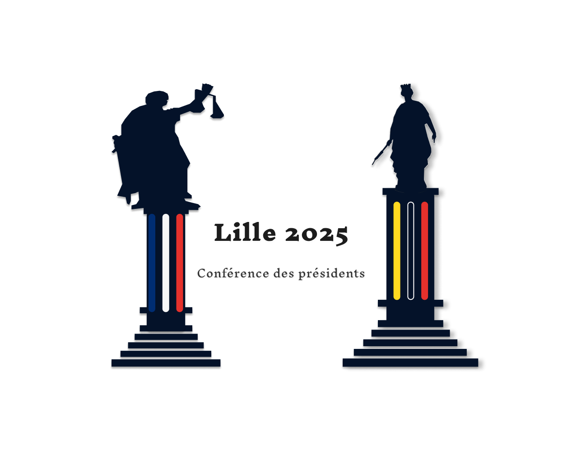
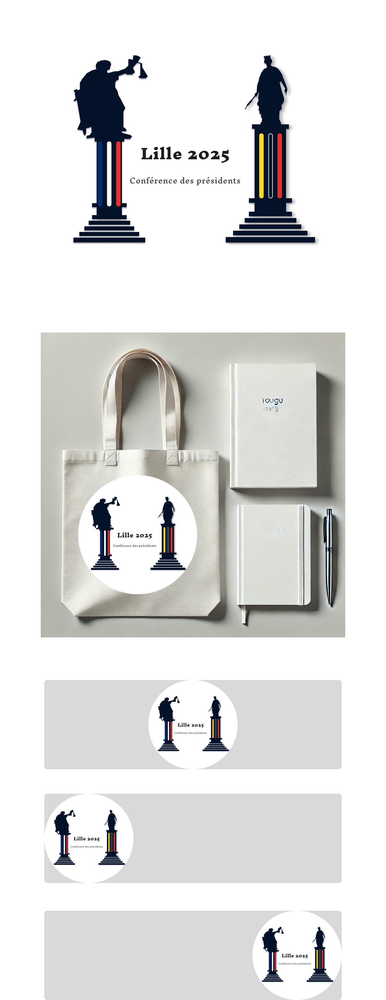

# **Logo 1 : Les Figures de Justice et de Liberté**

## Aperçu

### Plaquette

**Titre** : "Lille 2025 – Les Figures de Justice et de Liberté"\_

1. **Concept central** : Ce logo met en lumière deux statues emblématiques : **Thémis**, déesse de la justice, et la **statue de la Déesse**, figure symbolique de Lille. Ensemble, elles représentent des valeurs clés pour un événement de prestige comme la **Conférence des Présidents** : la justice et la liberté.

2. **Symbolisme des statues** :
   - **Thémis**, brandissant la balance de la justice, incarne la rigueur, l'équité, et l'ordre, des éléments essentiels pour une conférence de présidents.
   - **La statue de la Déesse**, monument emblématique de Lille, représente la résistance et la liberté, des valeurs profondément ancrées dans l'identité de la ville.
3. **Couleurs tricolores** : Les deux colonnes sont ornées de couleurs symbolisant à la fois la France (bleu, blanc, rouge) et les Flandres (jaune et rouge). Elles renforcent l’ancrage national et régional de cet événement de portée nationale.

4. **Conception minimaliste** : Ce design se distingue par sa simplicité visuelle, assurant une lisibilité immédiate. L’utilisation d’éléments épurés facilite son intégration sur divers supports tout en restant immédiatement reconnaissable.

5. **Message subliminal** : Par ce jeu de statues et de colonnes, ce logo transmet subtilement l’importance de l’unité et du dialogue, des piliers indispensables lors d’une conférence réunissant des présidents et hauts dignitaires.

6. **Conclusion** : _"Les Figures de Justice et de Liberté"_ est un logo qui, bien que symbolique, se démarque par une esthétique simple et élégante. Il ancre la conférence dans un cadre institutionnel tout en honorant la ville de Lille et ses valeurs de justice et de liberté. Un logo adapté pour des communications officielles, mais il peut paraître trop formel et manquer de la créativité nécessaire pour un événement aussi dynamique.
