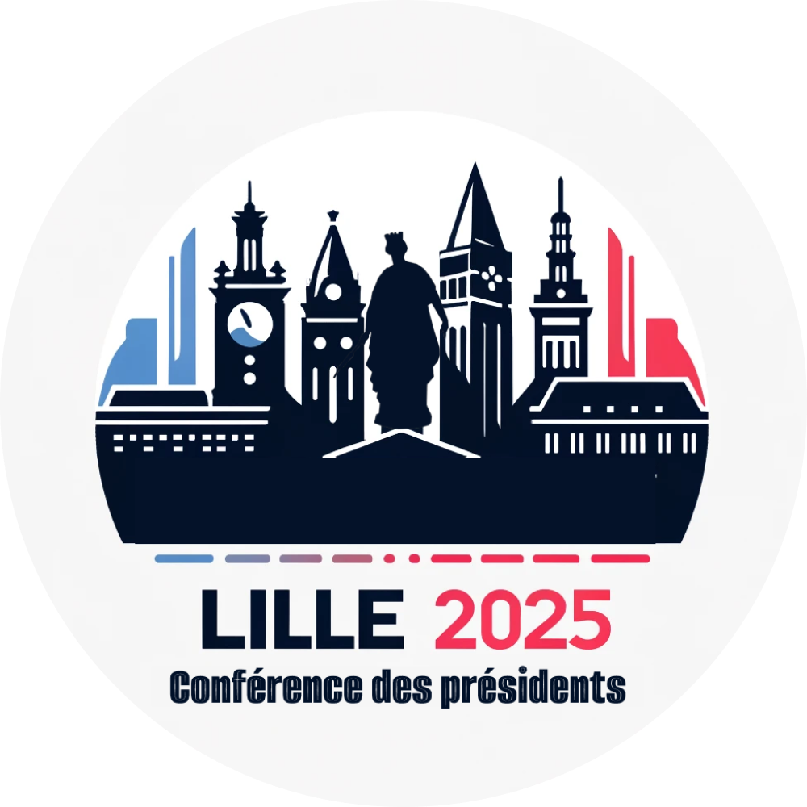

### **logo 2 : "Lille 2025 - L'Alliance des Monuments"**

## Aperçu

### Plaquette

### **Argumentaire**

1. **Concept central** :
   Ce logo met en avant l’unité entre plusieurs monuments historiques emblématiques de Lille, illustrant l’importance de la ville comme lieu d’échanges et de rencontres. Au centre, la figure de la **Déesse de Lille** trône sur les monuments environnants, tandis que les silhouettes des bâtiments évoquent des lieux notables comme le **Beffroi de Lille** et d'autres tours symboliques, créant une skyline reconnaissable.

2. **Composition harmonieuse et lisibilité** :
   L’utilisation de silhouettes nettes permet une lecture immédiate et claire des éléments. La **palette de couleurs tricolore** (bleu, blanc, rouge) souligne l’encrage national tout en respectant l’identité visuelle locale. Le logo reste élégant et structuré, offrant un impact visuel fort tout en restant facilement identifiable.

3. **Symbole de modernité et de tradition** :
   Le logo réussit à allier des éléments architecturaux historiques, tout en apportant une touche de modernité grâce à son design épuré. Les formes minimalistes et les lignes stylisées permettent une **harmonie** entre passé et présent, renforçant le rôle de Lille en tant que ville ancrée dans l’histoire, mais tournée vers l’avenir.

4. **Unité nationale et régionale** :
   La **palette tricolore** rappelle l’importance nationale de l’événement, tandis que les monuments choisis sont une célébration de l’histoire et de la culture régionales. Les bâtiments de Lille et leur disposition rappellent le rôle de la ville en tant que carrefour culturel, et la **statue de la Déesse** en point central symbolise l’esprit de la ville qui surplombe cette scène.

5. **Adaptabilité et impact visuel** :
   Ce logo se prête parfaitement à une utilisation sur différents supports (affiches, cartes de visite, supports numériques), et grâce à son équilibre entre détails architecturaux et simplicité des formes, il reste impactant quel que soit le format.

---

Ce logo pourrait être présenté comme un symbole de l’unité des monuments de Lille, mettant en avant l’importance de la **Conférence des Présidents** dans une ville à l’héritage riche et diversifié.

### Annexe

Certains monuments représentés dans ce logo pourraient être les suivants :

1. **La Déesse de Lille** (Colonne de la Déesse) : située au centre de la Grand'Place de Lille, elle est un symbole historique important de la ville.

2. **Le Beffroi de la Chambre de Commerce** : cet édifice emblématique de Lille est un exemple remarquable de l'architecture flamande et représente l'influence commerciale de la ville.

3. **L'Opéra de Lille** : autre bâtiment iconique de la ville, l'Opéra incarne la richesse culturelle et artistique de Lille.

4. **La Vieille Bourse** : probablement l'un des plus beaux monuments de Lille, cet édifice du XVIIe siècle symbolise l'héritage économique de la ville.

5. **La Tour de Lille** : représentant la modernité et l'architecture contemporaine, ce gratte-ciel est un symbole de l'évolution et du développement de la ville.

Ces monuments incarnent l'histoire riche et variée de Lille, alliant tradition et modernité.
