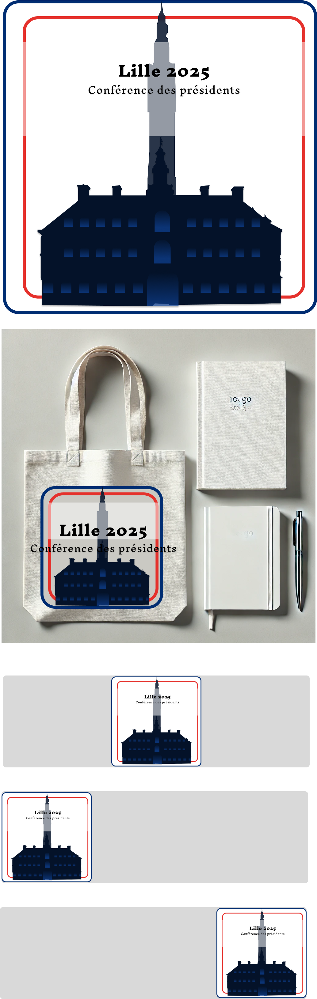

### Logo 3 : **"Lille 2025 - L'Union des Symboles"**

## Aperçu

### Plaquette

#### **Argumentaire :**

1. **Concept Central :**
   Ce logo représente deux monuments emblématiques de Lille, la **Vieille Bourse** et le **Beffroi de l'Hôtel de Ville**. Ils sont disposés sous forme de silhouettes, évoquant à la fois l'histoire et l'identité visuelle de la ville. La mise en avant de ces deux symboles souligne l'importance de la tradition et du patrimoine lillois pour l'événement de la **Conférence des Présidents**.

2. **Cohérence et Harmonie :**
   L’encadrement tricolore (bleu, blanc, rouge) confère au logo une identité à la fois locale et nationale, reflétant l’importance de cet événement à la fois régional et national. La structure du logo est claire, lisible, et adaptable à différents supports.

3. **Symbole de Confiance et d'Autorité :**
   Le **Beffroi** est souvent associé au pouvoir civique et à l'autorité, tandis que la **Vieille Bourse** symbolise l'histoire commerciale et l’ouverture de Lille sur le monde. L'union de ces deux bâtiments dans un même cadre évoque à la fois la solidité de l'organisation et la richesse culturelle de Lille.

4. **Impact Visuel et Simplicité :**
   Le style épuré du logo le rend facile à reconnaître et à mémoriser. Les formes simplifiées permettent une utilisation sur différents formats tout en conservant l’impact visuel.

Ce logo incarne donc la richesse historique de Lille à travers ses monuments emblématiques et la force de son patrimoine.
