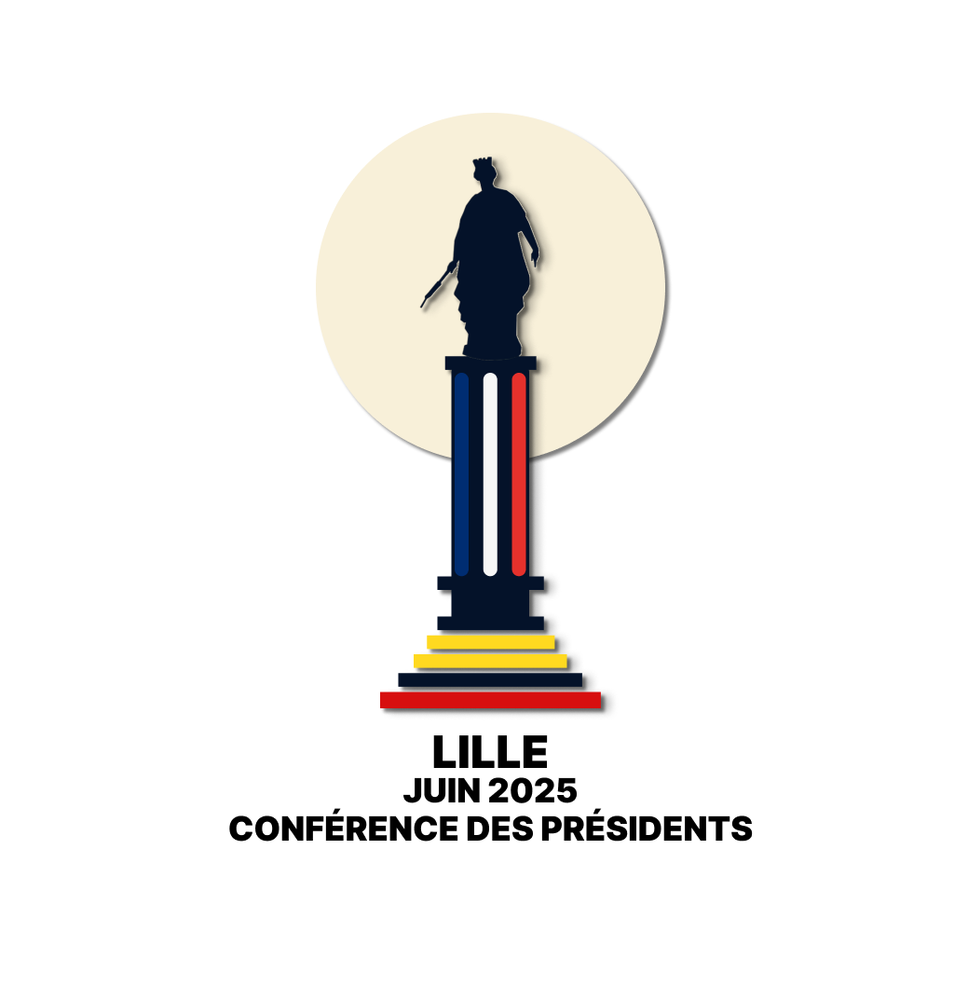
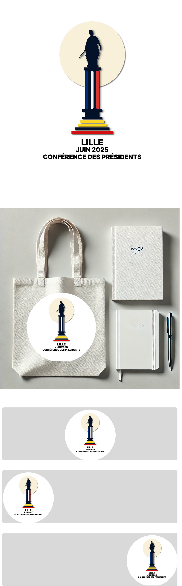

### **Logo 4 : "Lille 2025 - L'Équilibre des Symboles"**

## Aperçu

### Plaquette

### **Argumentaire :**

1. **Concept central** :
   Ce logo met en lumière la célèbre **statue de la Déesse**, un symbole historique fort de Lille, qui repose sur une colonne tricolore représentant les couleurs de la France (bleu, blanc, rouge) et un socle inspiré des couleurs des Flandres (jaune et rouge). Ce contraste entre le pilier français et le socle flamand symbolise **l'unité** entre les traditions nationales et régionales, soulignant le rôle de Lille comme carrefour culturel et historique.

2. **Symbolique visuelle** :

   - **Le Pilier tricolore** : Les couleurs françaises bleu, blanc et rouge apportent une dimension nationale à l'événement, rappelant l'importance de la **Conférence des Présidents** à l’échelle de la République.
   - **Le Socle flamand** : Avec ses couleurs jaune et rouge, il évoque les **Flandres**, rendant hommage à l’identité régionale du Nord.
   - **La Statue de la Déesse** : Représente la ville de Lille et son esprit de résilience, placé en point central du logo.

3. **Design épuré et moderne** :
   Le design reste simple et direct, en mettant l'accent sur les symboles principaux, sans surcharge graphique. Cette simplicité le rend adaptable à tous types de supports (digitaux ou physiques), tout en maintenant une forte **identité visuelle**.

4. **Unité nationale et régionale** :
   Ce logo capture l'**équilibre** entre les valeurs nationales et locales, et fait un clin d'œil à l'histoire de Lille, tout en rendant hommage à la région et à son importance dans l’histoire de la France.

5. **Impact et lisibilité** :
   L’utilisation de lignes claires et de couleurs franches permet une excellente lisibilité, que ce soit sur de petits ou grands formats. Ce logo pourra facilement être adapté pour des produits dérivés tels que des goodies, affiches ou documents officiels.

---

Ce logo symbolise à la fois **l'ancrage régional et national** de Lille et le rôle central que jouera la ville lors de la **Conférence des Présidents de 2025**.
