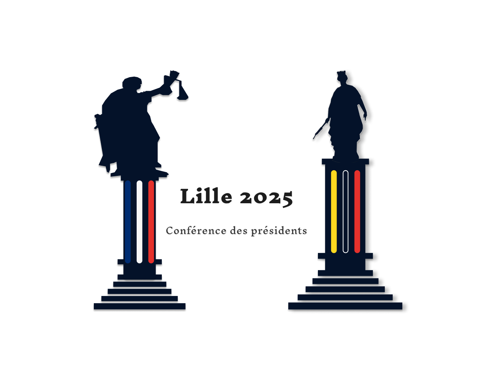

# **Compte rendu de l’entretien client (17 septembre 2024)**

## Logo 1 : Les Figures de Justice et de Liberté

#### **Sommaire :**

1. Contexte général
2. Points soulevés par le client
3. Modifications demandées
4. Prochaines étapes

---

### **1. Contexte général :**

Lors de l'entretien du 19 septembre 2024 avec le client, nous avons présenté la dernière version du logo, intitulé "Les Figures de Justice et de Liberté". Ce logo représentait deux figures emblématiques :

- À gauche : Thémis, la déesse de la justice.
- À droite : La Déesse de Lille.

Le client a exprimé un intérêt pour ce logo, mais a proposé des modifications afin de mieux refléter les attentes et l'identité de l'événement.

---

### **2. Points soulevés par le client :**

1. **Représentation de Thémis (à gauche) :**  
   Le client a estimé que la silhouette de Thémis paraissait "écrasée" et manquait de dynamisme. Il a demandé à ce que l’on trouve une **meilleure silhouette**, avec une posture plus imposante, **debout**, et où les **éléments emblématiques** de la déesse, à savoir le **glaive** et la **balance**, soient plus visibles et bien définis.

2. **Représentation de la Déesse de Lille (à droite) :**  
   Le client a demandé à **remplacer les couleurs actuelles** du pilier tricolore par un symbole plus fort, à savoir la **fleur de lys**, emblème historique de la ville de Lille, afin d’ancrer davantage le logo dans son **identité locale**.

3. **Texte à ajuster :**
   Le texte doit être restructuré en trois lignes distinctes pour améliorer la clarté et la lisibilité. Voici la nouvelle disposition demandée :
   - **Première ligne :** "Lille 2025"
   - **Deuxième ligne :** "Conférence des présidents et des présidentes"
   - **Troisième ligne :** "Juridictions administratives"

---

### **3. Modifications demandées :**

**1. Silhouette de Thémis :**

- Modifier la silhouette pour une version plus droite et imposante, en accentuant les éléments du **glaive** et de la **balance**.

**2. Déesse de Lille :**

- Supprimer les couleurs tricolores des Flandres du pilier de la déesse de Lille et remplacer par la **fleur de lys**, symbole de Lille.

**3. Texte :**

- Structurer le texte selon le modèle proposé par le client, en veillant à un espacement optimal entre les trois lignes.

### **4. Ébauche alternative :**

Dans une version alternative Tenter de coloriser le socle des déesses de couleurs briques

---

### **5. Prochaines étapes :**

- Réaliser les modifications demandées concernant les deux figures.
- Mettre à jour la présentation du texte.
- Proposer une nouvelle version du logo au client avant la date butoir.

---

Cordialement,  
Dammaretz Gaëtan

