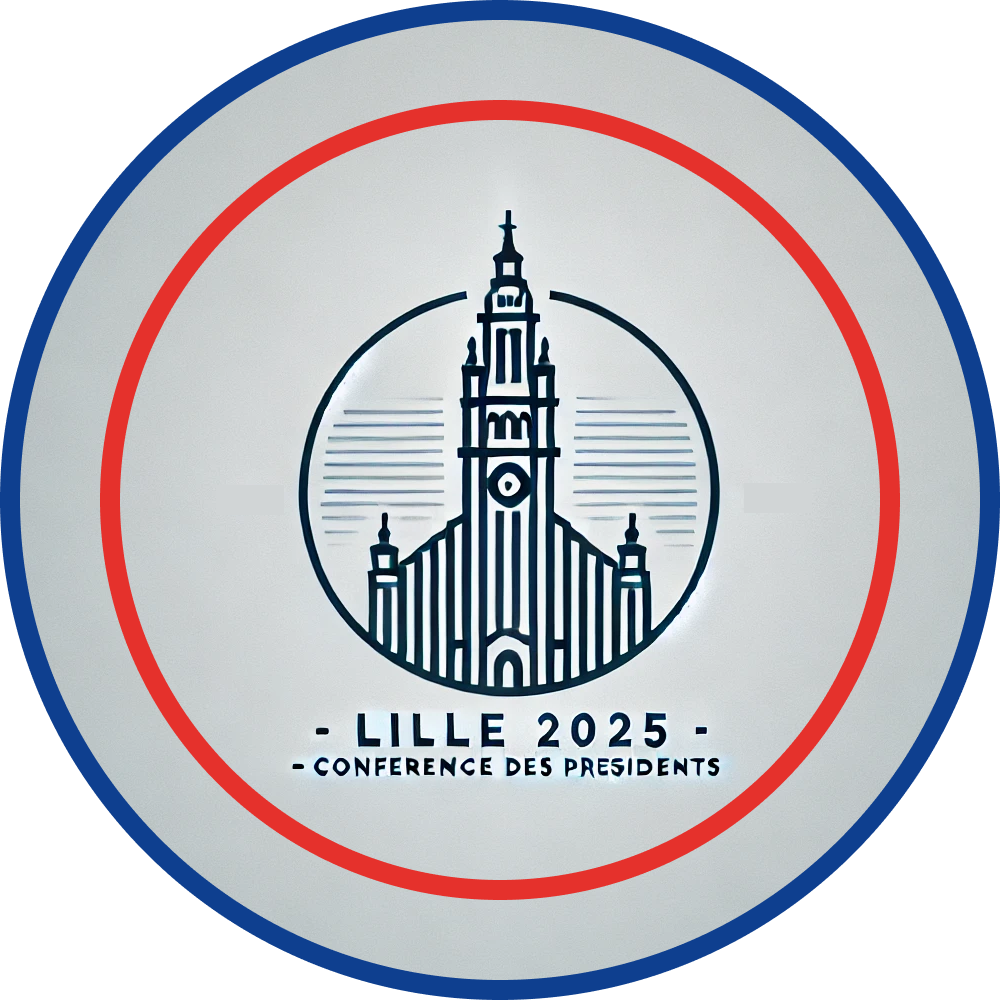

# **Compte rendu de l’entretien client (17 septembre 2024)**

## **Modification du logo "L'Éclat du Beffroi"**

### Image support

### Image à prélever

**Sommaire :**

1. Introduction
2. Points de modification
   - Intégration du beffroi coloré
   - Maintien du style minimaliste
   - Mise à jour du texte
3. Conclusion

---

### **1. Introduction :**

Suite à la présentation des logos, le client a porté son choix sur le logo intitulé **"L'Éclat du Beffroi"**. Cependant, il a exprimé certaines demandes de modification, notamment en intégrant des éléments du **beffroi coloré** issu d'une autre proposition.

---

### **2. Points de modification :**

- **Intégration du beffroi coloré :**  
  Le client souhaite que le **beffroi coloré**, présent dans une autre version du logo, soit intégré dans le cadre minimaliste de l'actuel "L'Éclat du Beffroi". Les couleurs distinctes de ce beffroi doivent être conservées tout en étant harmonisées avec l'approche graphique du logo.

- **Maintien du style minimaliste :**  
  Malgré l'ajout du **beffroi coloré**, l'aspect minimaliste doit être préservé. Le logo doit rester visuellement épuré, avec des **reflets vitrés subtils** et des lignes claires pour maintenir une lisibilité optimale et un design moderne.

- **Mise à jour du texte :**  
  Le texte sur le logo doit être ajusté comme suit :
  - Première ligne : **"Lille 2025"**
  - Deuxième ligne : **"Conférence des présidents et des présidentes"**
  - Troisième ligne : **"Juridictions administratives"**

---

### **3. Conclusion :**

Les modifications proposées visent à intégrer le **beffroi coloré** tout en respectant l'esthétique minimaliste du logo initial. Le texte sera mis à jour pour refléter la nature officielle de l'événement, tout en maintenant un équilibre entre modernité et patrimoine architectural.

---

Cordialement,  
Dammaretz Gaëtan

