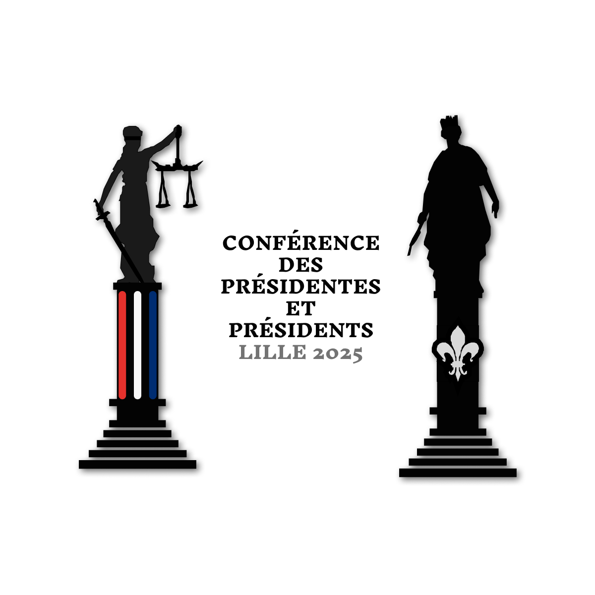
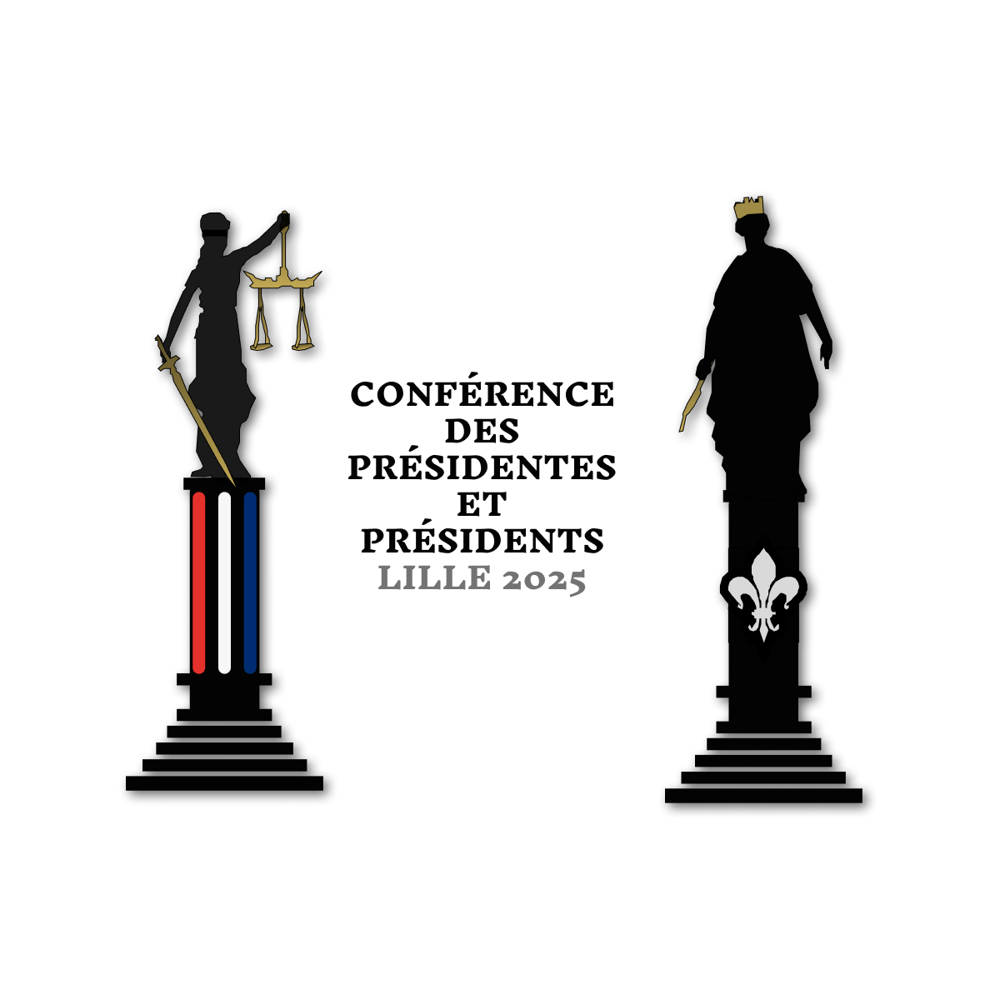

# Logo 1 - "Les Figures de la Justice et de la Liberté"

## Variante 1 - sans ornements

### variantes 1 - plaquette

## Variante 2 - ornements

### variantes 2 - plaquette

---

**Présentation du concept**

Le logo **"Les Figures de la Justice et de la Liberté"** met en scène deux figures symboliques majeures la statue de la **Justice** et celle de la **Liberté**. Ces deux personnages, placés de part et d'autre du texte, incarnent les valeurs fondamentales de la **Conférence des Présidentes et Présidents Lille 2025**. Ce choix iconographique évoque la stabilité, l'équité et l'émancipation, des valeurs essentielles pour une institution d’envergure.

### Un design symbolique et institutionnel

Les deux figures sont représentées en silhouettes noires, reflétant la solennité et l'autorité des symboles qu'elles incarnent. **La statue de la Justice**, avec son épée et sa balance, est un rappel visuel de l'importance du droit et de l'équité. De l’autre côté, **la Liberté**, couronnée et tenant un sceptre, évoque la souveraineté et la liberté individuelle, appuyée par une **fleur de lys**, symbole de royauté et de noblesse.

### Minimalisme et variations stylistiques

Deux versions sont présentées

- **Version avec dorure (bronze)** Cette version présente des détails dorés (ou bronze) sur la balance, l'épée, et la couronne, renforçant la grandeur et l'importance des figures. Ces touches dorées apportent un **côté classique et prestigieux**, parfait pour un événement officiel de cette envergure.
- **Version sans dorure** Ici, les éléments en bronze sont retirés, créant une version plus minimaliste. Cette approche met davantage l'accent sur les formes pures des statues et les couleurs tricolores du socle de la Justice. Elle peut convenir à une communication plus sobre et moderne.

### Couleurs et symboles

Le logo utilise subtilement les couleurs du **tricolore français** (bleu, blanc, rouge), notamment sur le socle de la statue de la Justice. Cela crée un lien direct avec la France tout en respectant la demande de discrétion pour le tricolore, puisque les couleurs ne dominent pas le design. Le socle de la Liberté, quant à lui, affiche une **fleur de lys**, symbole de prestige et de dignité, en blanc pour créer un contraste harmonieux avec le fond noir.

### Lisibilité et équilibre

Le texte, disposé au centre, est bien lisible grâce à un contraste élevé avec le fond blanc. La typographie utilisée est sobre, professionnelle et bien adaptée à l’importance de la conférence. L’espacement entre les deux statues et le texte permet une lecture fluide et un bon équilibre visuel.

### Points forts

- **Symbolisme fort** Les statues de la Justice et de la Liberté, avec leurs attributs distinctifs, apportent un symbolisme puissant et institutionnel.
- **Minimalisme équilibré** Que ce soit avec ou sans les touches dorées, le design reste élégant et minimaliste, répondant aux attentes d’un logo institutionnel.
- **Tricolore discret** L’utilisation subtile du bleu, blanc et rouge sur le socle de la Justice renforce l’identité nationale sans surcharger le logo.
- **Adaptabilité** Le logo, dans ses deux versions, est adaptable à différents supports de communication, tout en conservant son impact visuel.

---

### Checklist des attentes du client

1. **Approche minimaliste**

   - Les silhouettes des deux figures, dans leur simplicité, répondent parfaitement à l’approche minimaliste demandée.

2. **Symboles de justice et liberté**

   - Les statues représentent la **Justice** et la **Liberté**, des valeurs clés pour la conférence.

3. **Inclusion discrète du tricolore**

   - Le tricolore est visible sur le socle de la statue de la Justice, mais reste subtile et non dominante.

4. **Lisibilité et clarté du texte**

   - Le texte est bien centré et lisible, avec une typographie adaptée pour un événement officiel.

5. **Adaptation au style institutionnel**
   - Les deux versions (avec et sans dorure) permettent une flexibilité en fonction du contexte d’utilisation (prestigieux ou plus moderne).

---

### Conclusion

Le logo **“Les Figures de la Justice et de la Liberté”** présente un équilibre parfait entre symbolisme institutionnel et sobriété visuelle. Les deux versions proposées, l'une plus classique avec des touches de bronze et l'autre plus minimaliste, permettent de répondre à diverses utilisations. Ce logo est prêt à être utilisé pour représenter la **Conférence des Présidentes et Présidents Lille 2025**, en incarnant les valeurs de justice, liberté et prestige que l’événement souhaite communiquer.

---

Cordialement,  
Dammaretz Gaëtan

