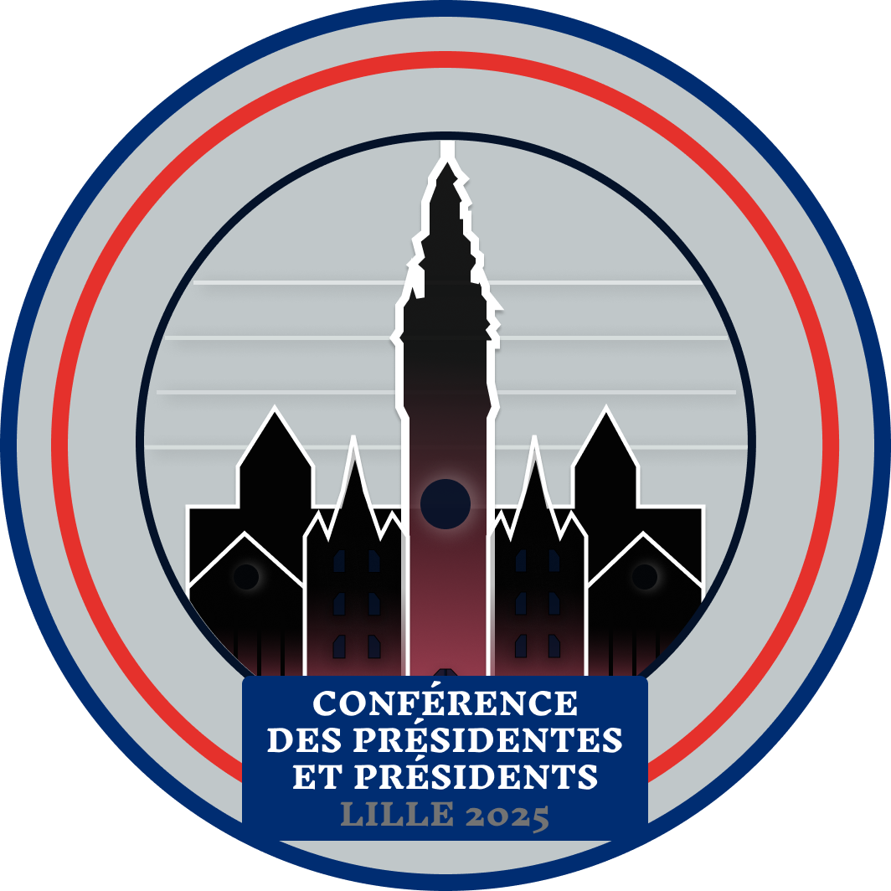
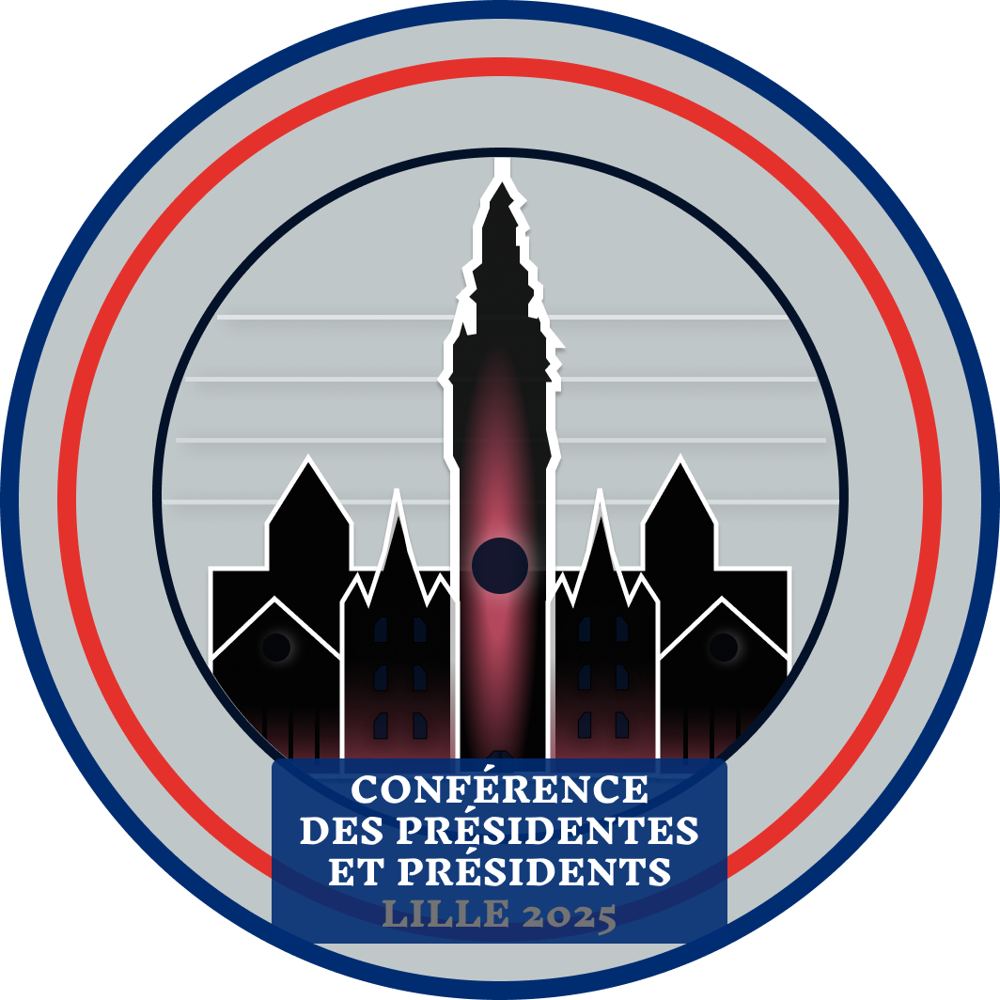
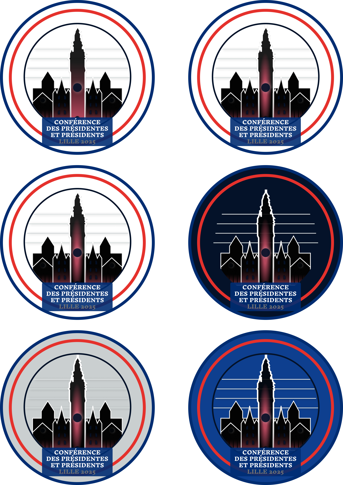

# Logo 2 - “L’éclat du Béffroi”

## Variante 1 - dégradé linéaire

## Variante 2 - dégradé radial

### Plaquette

---

**Présentation du concept :**

Le logo **“L’éclat du Béffroi”** a été conçu pour représenter à la fois la solennité de la **Conférence des Présidentes et Présidents** et l’identité visuelle forte de la ville de **Lille** et de la région. Le **béffroi de l’Hôtel de Ville de Lille**, figure emblématique de la ville, en est le cœur, illustré dans un style minimaliste pour respecter l’approche sobre et élégante souhaitée.

### Design minimaliste et symbolisme local

Le design repose sur l’idée d’un **minimalisme épuré**, avec des formes simples mais expressives. Le **béffroi**, entouré de bâtiments en silhouette, symbolise le patrimoine et l’importance de Lille dans l’organisation de cet événement prestigieux. Les éléments architecturaux sont représentés dans des teintes sombres, permettant une lecture immédiate et cohérente du logo.

### Couleur et inspiration régionale

La subtilité du **rouge**, rappelant les briques caractéristiques du Nord, est intégrée via un **dégradé radial**. Cette approche permet de conserver l’identité visuelle régionale tout en évitant un design trop chargé. Le rouge, concentré sur le béffroi, donne de la profondeur au logo sans compromettre son aspect minimaliste.

Les **cercles concentriques** en bleu, blanc et rouge répondent à une demande d’inclusion du tricolore sans en faire un élément central trop imposant. Cette disposition reste discrète tout en rappelant l’importance institutionnelle de l’événement.

### Visibilité et lisibilité optimales

Le texte de la **Conférence des Présidentes et Présidents Lille 2025** est placé sur un **fond bleu solide**, garantissant une **lisibilité parfaite**. Ce choix assure un bon contraste avec les éléments graphiques en arrière-plan, sans détourner l’attention de la silhouette du béffroi. La typographie utilisée est claire, professionnelle, et reflète le sérieux de l’événement.

### Points forts :

- **Symbole régional fort** : L’intégration du béffroi de Lille comme élément central offre une reconnaissance immédiate du lieu.
- **Minimalisme raffiné** : Une approche visuelle sobre, avec des formes épurées et des couleurs restreintes, garantit une image élégante.
- **Subtilité du rappel des briques rouges du Nord** : La touche rouge discrète via un dégradé radial rappelle l’identité régionale sans alourdir le design.
- **Lisibilité assurée** : Le fond bleu du texte offre un bon contraste et une lisibilité impeccable, essentiel pour une communication efficace.

---

### Checklist des attentes du client :

1. **Inclusion de monuments emblématiques de Lille** :

   - Le **béffroi de l’Hôtel de Ville** est au centre du logo, reconnaissable immédiatement.
   - Des bâtiments représentés en silhouette pour évoquer l’architecture locale.

2. **Approche minimaliste** :

   - Le design reste épuré avec un minimum de détails superflus, tout en restant expressif.

3. **Rappel de la couleur rouge des briques du Nord** :

   - Un **dégradé rouge subtil** dans la silhouette du béffroi rappelle la brique rouge typique de la région.

4. **Discrétion du tricolore** :

   - Le bleu, blanc et rouge est inclus de manière discrète dans les cercles extérieurs, sans prendre le dessus sur l’élément principal.

5. **Lisibilité du texte** :

   - Le texte est placé sur un fond bleu solide, garantissant une lecture claire et professionnelle.

6. **Simplicité et efficacité** :
   - L'ensemble du logo est conçu pour être immédiatement reconnaissable, fonctionnel à toutes les tailles, et adapté pour les supports numériques comme imprimés.

---

### Conclusion

Le logo **“L’éclat du Béffroi”** répond parfaitement aux attentes du client en combinant sobriété, élégance et symbolisme local. Chaque élément a été pensé pour offrir un design harmonieux, cohérent avec l’esprit de la conférence, et ancré dans la culture et l’identité visuelle de Lille et du Nord. Ce logo est prêt à représenter efficacement la **Conférence des Présidentes et Présidents Lille 2025**, à la fois dans sa communication officielle et sur ses supports promotionnels.

---

Cordialement,  
Dammaretz Gaëtan

