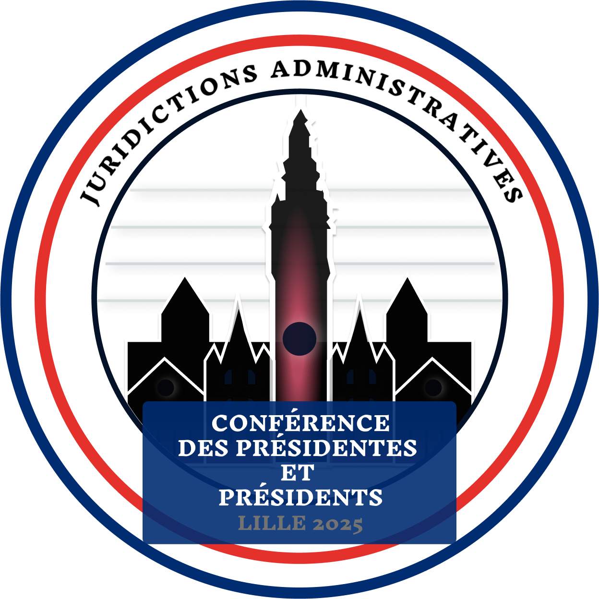

### Synthèse de l'entretien - Logos "Conférence des Présidents 2025"

**Date :** lundi 23 septembre 2024  
**Présents :**

- Président du Tribunal Administratif
- Madame Catteau (Greffière en chef)
- Madame Fabre (Responsable informatique)
- Gaëtan Dammaretz (Développeur web - Alternant)

---

#### Objet de l'entretien

Validation des dernières versions des logos pour la Conférence des Présidents 2025, intégrant les modifications demandées lors des précédentes réunions.

---

#### Discussion et points abordés

1. **Présentation des Logos Retouchés :**

   - **Logo 1 : "Les Figures de Justice et de Liberté"**

     - **Déesse de Lille :**
       1. La **fleur de lys** a été recentrée sur le pilier, conformément à la demande initiale, afin de mieux symboliser l'attachement historique de Lille.
       2. Les éléments du socle ont été modifiés pour représenter visuellement les **briques du Nord**, conférant un aspect régional au design.
     - **Thémis, déesse de la justice :**
       1. Le tricolore du drapeau français a été rectifié (l'ordre des couleurs a été ajusté) pour correspondre aux standards visuels de la République.

   - **Logo 2 : "L'Éclat du Beffroi"**
     - Aucun ajustement n'a été nécessaire suite aux modifications précédentes. Le logo a été validé tel quel, considérant qu'il correspond pleinement aux attentes du client.

2. **Validation Finale :**

   - Le président a exprimé sa satisfaction quant aux ajustements apportés, notamment sur le **Logo 1** qui reflète désormais mieux l'identité de l'événement.
   - Madame Catteau a souligné l'importance de conserver une cohérence graphique sur tous les supports, et a validé les logos pour les documents officiels.
   - Madame Fabre a rappelé que ces versions finales des logos devront être intégrées dans tous les supports de communication, et a confirmé qu'aucune autre retouche n'était requise.

3. **Prochaines Étapes :**
   - Lancer la phase de vote auprès du personnel pour choisir entre les deux logos. Le vote se déroulera sur une période de **48 heures** à partir de vendredi 27 septembre 2024.
   - Une fois le logo choisi, entamer la préparation des déclinaisons graphiques (bannières, en-têtes, visuels pour les réseaux sociaux, etc.).
   - Prévoir une session de travail pour intégrer le logo retenu dans le **wireframe** et le **maquettage** du site.

### Dernières versions des logos

---

#### Conclusion

Les logos ont été validés et les prochaines étapes de vote et d'intégration sont planifiées. L'équipe est satisfaite du travail accompli, et les logos sont désormais prêts pour être intégrés aux supports de communication de l'événement.

---

#### Remarques supplémentaires

- Le président a insisté sur l'importance de respecter les délais fixés pour la validation du logo et la préparation des supports de communication.
- Il a également souligné le besoin de prévoir des ajustements rapides si le vote interne révèle des préférences inattendues.

---

